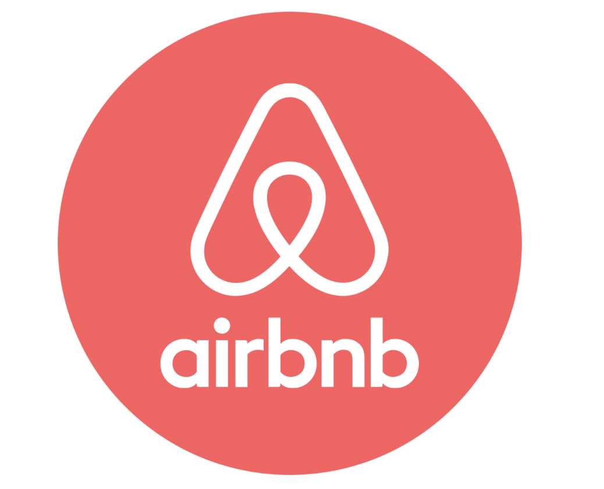

# Airbnb-Recommender



# Milan Airbnb Recommender
Creating a recommendation system for individuals who have stayed previously at Milan Airbnb and are wishing to at a new one. 

By: Anat Jacobson 

--- 


# Contents [fixing this]
<l></l>

<span style="font-size:1.2em;">

- <a href="#Overview">Overview</a>

- <a href="#Introduction and Business Case">Introduction and Business Case</a>  

- <a href="#Business Understandings">Business Understandings</a> 
    - <a href="#Applications">Applications</a>
    
    - <a href="#Methodology">Methodology</a>
- <a href="##Data Exploration and Analysis">Data Exploration and Analysis</a>

- <a href="#Recommendation System">Recommendation System</a>
    
    - <a href="#Surprise Data">Surprise Data</a>
    
    - <a href="#Baselines">Baselines</a>
    
    - <a href="#SVD">SVD </a>
    
    - <a href="#NMF">NMF</a>
    
    - <a href="#SVD++">SVD++</a>
    
- <a href="#Recommendation Function">Recommendation Function</a>
       
- <a href="#Conclusion and Next Steps">Conclusion and Next Steps</a>

### Overview 

In this notebook I will be creating a recommedation system for Milan Airbnb users. This project is based on data from previous visitors and reviewers of Milan's airbnb. The data has been used to create a various recommendation models and provide valuable insight into whether an airbnb would be liked or recommended by an individual or not. This be extremely helpful for both guests and hosts when looking into where to stay next so that they could have a personalized experience that they could enjoy based on past experiences. 

### Introduction and Business Case

There are thousands of Airbnb options within Milan but each one comes with different perks and ammenities. With so many listings available on the airbnb platform, it can be overwhelming for guests to find the perfect accommodation for their needs. A recommendation system could analyze a user's previous bookings, preferences, and behaviors to suggest listings that are likely to meet their needs and exceed their expectations. By providing personalized recommendations, a recommendation system could enhance the user experience on Airbnb and increase customer satisfaction, ultimately leading to higher retention rates and revenue for the platform.

The data for this notebook has been provided by Inside Airbnb:  Airbnb through <a href="http://insideairbnb.com/milan" >Milans data</a>.

### Business Understandings

#### Applications
- Airbnb users can make informed decisions when deciding which airbnb to rent next and have a great experience
- Airbnb itself will also benefit from users having more personalized expereience they would likely have higher retention and revenue rates when more customers are enjoying each airbnb stay. 

#### Data 
The dataset that was worked with after cleaning had over 45K reviews in it with data that focused on the datetime information of the review as well as information of of idententifying the listing iteself payment. The secondary dataset contained data on the ammenities of the listing as well as some helpful information on the host. 


### Methodology
The initial data being worked with did not containing a rating scale for how well liked the airbnb was by user. Because of this, I created a sentiment analysis score that took the sentiment of the comment and rated it between 1-10 on how much the user liked the airbnb. This score is what the recommendation system will be based off of.

### Sentiment Analyzer + Scoring
In order to create a recommendation system we will need to have some sort of rating system. in the given dataset we do not have any scores however we can create makeshift ratings based off of the sentiment of the given user. Below we will be instantiating a sentiment analyzer to create these scores and then using the polarity score to create a rating system of 1-10 of how the users comments (essentially) would be rating a given airbnb. This system and function has also been adapted from the previous work of Alex Gastone.

## Best Model and Recommendations

Using SVD++ to create final model. This is a collaborative filtering method that identifies relationship between users airbnb ratings to make personzlied recommendations for users, based on their previous comments on other airbnbs.

Our best model was the final SVDpp Grid Search that gave us a RMSE of 1.7539.

- n_factors = 4
- reg_all = .05
- n_epochs = 30    
--- 
## Recommendation Function

- Producing a function that spits out our predictions for recommended airbnbs based on the user. This function has been adapted from Daniel Burdeno's recommendation function from his capstone project linked here: https://github.com/danielburdeno/Kindle-eBook-Recommendations/blob/main/CollaborativeFiltering.ipynb
- Cleaning and doing some analysis on the listing dataframe in order to use the dataframe for comparitive purposes when recieving recommendations. This way, when a user enters his/her ID, he/she can see what features the recommeded airbnb offers as well.
    
--- 
# Conclusion and Next Steps:

My recommendation model aims to simplify the Airbnb selection process for individuals by providing personalized Airbnb suggestions based on their previous airbnb booking and reviews. By predicting expected ratings for Airbnb's that users have yet to review, I hope to encourage more accurate reviews, which will result in even better recommendations for each individual. 

To enhance the predicted ratings and improve the overall user experience, I am exploring several directions for further development. These iterations include:

- Run more grid searches and use different model types to improve the RMSE for the best predictions
- Add in a additional options to function to allow the user to get recommended airbnb for a specific characteristics of an airbnb (such as size, ammenities, neighborhood).
- Look further into a content based filtering in addition to our collaborative model.
- Add recommendation ratings to the Airbnb interface (deploy website or app) 


Thank you!
  


--- 
# References and Resources: 
<b> Referencing a lot of work done by: Alex Gastone </b> 

- https://github.com/alexgastone/AirbnbRecommend/blob/master/Airbnb_CollabFiltering.ipynb. (Will be changing code more as continuing to iterate)
- https://medium.com/@alexandra.gg150/how-to-build-a-recommender-system-for-airbnb-in-python-3a92ad500fa5

<b> Packageg information and other resources looked into: </b> 
- https://towardsdatascience.com/4-python-libraries-to-detect-english-and-non-english-language-c82ad3efd430
- https://pypi.org/project/langdetect/
- https://pypi.org/project/google-trans-new/
- https://stackoverflow.com/questions/43146528/how-to-extract-all-the-emojis-from-text
- https://pypi.org/project/emoji/
- https://www.pauldesalvo.com/extract-emojis-from-python-strings-and-chart-frequency-using-spacy-pandas-and-plotly/
- https://wellsr.com/python/convert-text-to-emojis-and-vice-versa-in-python/#:~:text=To%20convert%20emojis%20in%20the,token%20with%20the%20corresponding%20text.
- https://stackoverflow.com/questions/73108683/getting-error-cannot-import-name-unicode-emoji-from-emoji-unicode-codes
- https://wellsr.com/python/convert-text-to-emojis-and-vice-versa-in-python/#:~:text=To%20convert%20emojis%20in%20the,token%20with%20the%20corresponding%20text.
---
# For Further Information
My process is available in [this jupyter notebook](./index.ipynb) or abbreviated in [this presentation document](./presentation.pdf).

Anat Jacobson is available on [github (anat-jacobson)](https://github.com/anat-jacobson) and via [email (anatabigail@gmail.com)](mailto:anatabigail@gmail.com)  


```
Airbnb Recommendations-Capstone
├── data
│  ├── listings.csv
│  ├── reviews.zip.csv
├── images
│  └── (resource images)
├── Airbnb_Reccomendations_Collab_Modelings.ipynb
├── presentation.pdf
├── LICENSE
└── README.md
```