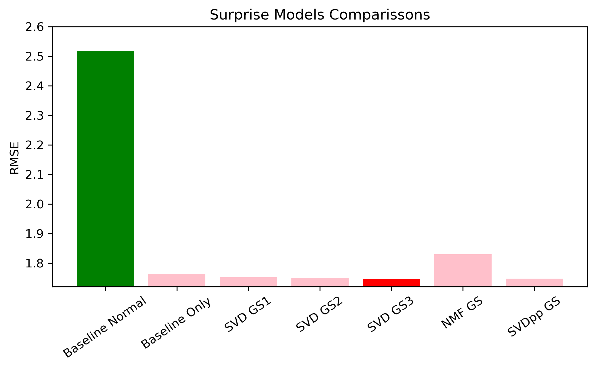

# Milan Airbnb Recommender
Creating a recommendation system for individuals who have previously stayed at a Milan Airbnb and are wishing to find a new one to stay at. 

By: Anat Jacobson 

--- 


### Overview 

In this notebook I will be creating a recommedation system for Milan Airbnb users. This project is based on data from previous visitors and reviewers of Milan's Airbnbs. Data from insides Airbnb has been used to create a various recommendation models and provide valuable insight into whether an airbnb would be liked or recommended by an individual or not. This would be extremely helpful for both guests and hosts when looking into where to stay next. This way,  they could have a personalized experience that they could enjoy based on past experiences. 

### Introduction and Business Case

There are thousands of Airbnb options within Milan but each one comes with different perks and ammenities. With so many listings available on the Airbnb platform, it can be overwhelming for guests to find the perfect accommodation for their needs. A recommendation system could analyze a user's previous bookings, preferences, and behaviors to suggest listings that are likely to meet their needs and exceed their expectations. By providing personalized recommendations,this system could enhance the user experience on Airbnb and increase customer satisfaction, ultimately leading to higher retention rates and revenue for the platform.

The data for this notebook has been provided by [Inside Airbnb: Milan](http://insideairbnb.com/milan")

### Business Understandings

#### Applications
- Airbnb users can make informed decisions when deciding which airbnb to rent next and have a great experience
- Airbnb itself would also benefit from users having more personalized expereience as they would likely have higher retention and revenue rates when more customers are enjoying each airbnb stay. 

#### Data 
The dataset that was worked with after cleaning had over 45K reviews in it with data that focused on the datetime information of the review as well as information of of idententifying the listing iteself payment. The secondary dataset contained data on the ammenities of the listing as well as some helpful information on the host. This secondary dataset will primarily be used for comparison purposes when understanding how the recommendatin system is performing in a practical sense. 
- 18.6K Reviewers ranging from 2-26 reviews
- 9.2K airbnbs across Milan
- Spans 12 years of reviews from 2011 - 2023
- Listing accomodations ranging from 1-16 people, on average accomodations are for 3 people


#### Methodology
The initial data being worked with did not containing a rating scale for how well liked the airbnb was by user. Because of this, I created a sentiment analysis score using NLTK's vader that took the sentiment of the comment and rated it between 1-10 on how much the user liked the airbnb. This score is what the recommendation system will be based off of. I will go into more detail on this system as I go through this notebook. 

---
### Using Detect for Language Capturing
Using Detect library to capture what language the reviews are in so that the non english reviews can be dropped. Detect comes from langdetect and is using Googles languge detection library originally in Java. More information on this can be found [here](https://pypi.org/project/langdetect/)

Below, adding the column for what language the reviews are in and then dropping all non english reviews.

### Sentiment Analyzer + Scoring
In order to create a recommendation system we will need to have some sort of rating system. In the given dataset we do not have any scores, however, we can create makeshift ratings based off of the sentiment of the given user. Below we will be instantiating nltk's sentiment analyzer to create these scores and then using the polarity score to create a rating system of 1-10 of how the users comments (essentially) would be rating a given airbnb. This system and function has also been adapted from the previous work of Alex Gastone.

## Model Comparissons & Best Model



As can see above, the best model which is SVDGS3. This is a collaborative filtering method that identifies relationship between users airbnb ratings to make personzlied recommendations for users, based on their previous comments on other airbnbs.

My best model was the final SVD Grid Search that gave us a RMSE of 1.746.

- n_factors = 5
- reg_all = .05
- n_epochs = 40

These hyperparameters mean:
- n_factors are the number of factors that were used in this model to infer similarity and provide a recommendation. The default for this package is 100.
- reg_all is the regularization term for all the parameters.
- n_epochs are the number of iteration of the SGD (stochastic gradient descent), default being 20. 

For more information see suprise documentation [here](https://surprise.readthedocs.io/en/stable/matrix_factorization.html)

SVD model compares to our baseline (highlighted in green). Although it might not seem like such a large gap in RMSE, this is saying that our best model has and RMSE of 1.746 while our baseline normal is over 2.5. This is a large difference when understanding what these scores are. Our baseline normal predicts on average a rating around 2.5 points away from the actual while the best model predicts around 1.7 points away which is an increase of over 40% in prediction accuracy.
 
--- 
## Recommendation Function

- Producing a function that spits out predictions for recommended airbnbs based on the user. This function has been adapted from Daniel Burdeno's recommendation function from his capstone project linked here
- Cleaning and doing some analysis on the listing dataset in order to use the dataframe for comparitive purposes when recieving recommendations. This way, when a user enters his/her ID, he/she can see what features the recommeded airbnb offers as well.


This user highly 2 apartments that were whole homes, host responded within an hour and accomodated 2 people. The top rated from the recommendation system similarly showed 2 people apartments with high response rate from host.
    
--- 
# Conclusion and Next Steps:

My recommendation model aims to simplify the Airbnb selection process for individuals by providing personalized Airbnb suggestions based on their previous airbnb booking and reviews. By predicting expected ratings for Airbnb's that users have yet to review, I hope to encourage more accurate reviews, which will result in even better recommendations for each individual. 

To enhance the predicted ratings and improve the overall user experience, I am exploring several directions for further development. These iterations include:

- Runnig more grid searches and use different model types to improve the RMSE for the best predictions
- Add in a additional options to function to allow the user to get recommended airbnb for a specific characteristics of an airbnb (such as size, ammenities, neighborhood).
- Look further into a content based filtering in addition to our collaborative model.
- Add recommendation ratings to the Airbnb interface (deploy website or app with streamlit)
- Translate emojis to text to analyze more reviews from the dataset
- Apply the model to other cities and test for other results.


Thank you!
  
# For Further Information
My process is available in [this jupyter notebook](./Airbnb_Recommendations_Collab_Modelings.ipynb) or abbreviated in [this presentation document](./Milan_Airbnb_Presentation.pdf).

Anat Jacobson is available on [github (anat-jacobson)](https://github.com/anat-jacobson) and via [email (anatabigail@gmail.com)](mailto:anatabigail@gmail.com)  

--- 
# References and Resources: 
<b> Referencing a lot of work done by: Alex Gastone </b> 

- https://github.com/alexgastone/AirbnbRecommend/blob/master/Airbnb_CollabFiltering.ipynb. (Will be changing code more as continuing to iterate)
- https://medium.com/@alexandra.gg150/how-to-build-a-recommender-system-for-airbnb-in-python-3a92ad500fa5

<b> Packageg information and other resources looked into: </b> 
- https://towardsdatascience.com/4-python-libraries-to-detect-english-and-non-english-language-c82ad3efd430
- https://pypi.org/project/langdetect/
- https://pypi.org/project/google-trans-new/
- https://stackoverflow.com/questions/43146528/how-to-extract-all-the-emojis-from-text
- https://pypi.org/project/emoji/
- https://www.pauldesalvo.com/extract-emojis-from-python-strings-and-chart-frequency-using-spacy-pandas-and-plotly/
- https://wellsr.com/python/convert-text-to-emojis-and-vice-versa-in-python/#:~:text=To%20convert%20emojis%20in%20the,token%20with%20the%20corresponding%20text.
- https://stackoverflow.com/questions/73108683/getting-error-cannot-import-name-unicode-emoji-from-emoji-unicode-codes
- https://wellsr.com/python/convert-text-to-emojis-and-vice-versa-in-python/#:~:text=To%20convert%20emojis%20in%20the,token%20with%20the%20corresponding%20text.
---


```
Airbnb Recommendations-Capstone
├── data
│  ├── listings.csv
│  ├── reviews.zip.csv
│  ├── export_reviews.csv   
│  ├── export_listings.csv   
│  └── final_df_export.csv
├── images
│  ├── (model images) 
│  └── (resource images)
├── Airbnb_Recommendations_Collab_Modelings.ipynb
├── Milan_Airbnb_Presentation.pdf
├── environment.yml
├── requirements.txt    
├── model.sav   
├── LICENSE
└── README.md
```